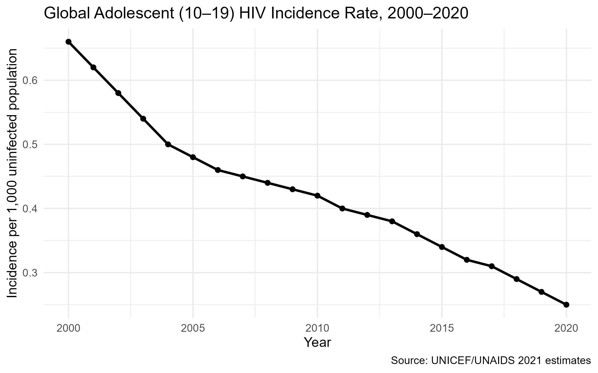

```{r setup, include=FALSE}
knitr::opts_chunk$set(echo = TRUE, message = FALSE, warning = FALSE)
library(readr); library(knitr); library(dplyr)
```

# Introduction

This report reproduces the **adolescent (10–19) HIV incidence** summary table (2020) and a **global
incidence trend figure (2000–2020)** from the UNICEF/UNAIDS 2021 dataset.

# Required Table

```{r table-read}
tbl <- readr::read_csv("../outputs/table_top10.csv", show_col_types = FALSE)
kable(tbl, caption = "Top 10 countries by adolescent (10–19) HIV incidence per 1,000 uninfected (2020, Both).", digits = 2,
      align = c("l","c","c","c","c"))
```

# Required Figure

```{r figure-include, out.width="90%", fig.align='center'}

```

# Notes

- Table and figure are generated by scripts in `R/` and written to `outputs/`.
- See `README.md` for exact reproduction steps using `make`.
